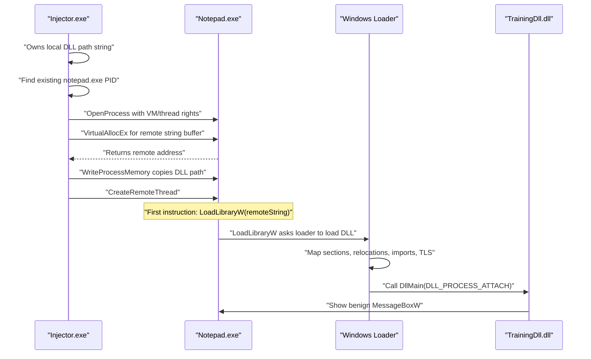

# Lesson 1: Classic DLL Injection Timeline

This lesson teaches classic DLL injection as a complete timeline, not as a list of APIs. The student should come away with one central question in their head:

Which process owns this memory, and is this pointer valid in the target?

The lab target is a Notepad instance that the student starts before running the injector. The training DLL is benign and only displays a message box. The point is to understand the mechanism and the artifacts, not to hide from tools or inject into unrelated processes.

## Learning Goals

By the end of this lesson, students should be able to explain:

- why a pointer in the injector is not automatically valid in Notepad
- why the DLL path must be copied into the target process
- why `CreateRemoteThread` does not load a DLL by itself
- why `LoadLibraryW` must run inside the target process
- when the Windows loader takes over
- when the first instruction from our DLL runs
- which artifacts a defender could observe

## The Big Idea

Classic DLL injection is a bridge between two process address spaces.

The injector starts with a local string:

```text
C:\Labs\InjectorTraining\TrainingDll.dll
```

That string lives in the injector's memory. The address of that string is only meaningful inside the injector process. If the injector passes that local pointer to Notepad, Notepad will treat the numeric address as an address in Notepad's own virtual address space. That address may be unmapped, or it may point to unrelated data.

So the injector must create a second copy of the string inside Notepad.

After `WriteProcessMemory`, the DLL path exists twice:

- local copy: owned by the injector
- remote copy: owned by Notepad

Only the remote address is valid as the parameter to code running inside Notepad.

## Complete Timeline

Classic DLL injection into a student-opened Notepad process looks like this:

1. The injector has a local DLL path string.
2. The local string pointer is meaningful only in the injector's address space.
3. Notepad cannot dereference that local pointer.
4. The injector takes a process snapshot and finds an existing `notepad.exe` PID.
5. The injector opens that Notepad process with rights for memory operations and thread creation.
6. The injector allocates memory inside Notepad with `VirtualAllocEx`.
7. `VirtualAllocEx` returns a remote address. That address is meaningful inside Notepad.
8. The injector copies the DLL path into that remote allocation with `WriteProcessMemory`.
9. The DLL path now exists in both processes.
10. The injector starts a thread inside Notepad.
11. The new thread's first function is `LoadLibraryW`.
12. The new thread's first parameter is the remote DLL string address.
13. On x64 Windows, conceptually:

```text
RIP = LoadLibraryW
RCX = remoteString
RSP = new thread stack
```

14. `LoadLibraryW` reads the DLL path from Notepad memory.
15. The Windows loader loads the DLL:

    - reads PE headers
    - maps sections
    - applies relocations
    - resolves imports
    - runs TLS callbacks
    - calls `DllMain`

16. `DllMain(DLL_PROCESS_ATTACH)` is the first normal entry point from our DLL.
17. The training DLL starts its benign demo logic and shows a message box.

## Diagram



## Why Each API Exists

| Step | API or action | Why it exists | Artifact left behind |
| --- | --- | --- | --- |
| Find target | `CreateToolhelp32Snapshot` / `Process32FirstW` / `Process32NextW` | The lab requires the student to start Notepad first, then discovers that local target process. | Process enumeration showing `notepad.exe` and its PID. |
| Get process access | `OpenProcess` | The injector needs a handle that allows remote allocation, writing, and thread creation. | Handle with `PROCESS_VM_OPERATION`, `PROCESS_VM_WRITE`, and `PROCESS_CREATE_THREAD`. |
| Allocate target memory | `VirtualAllocEx` | The DLL path must live in Notepad memory because `LoadLibraryW` will run in Notepad. | New private writable memory region in Notepad. |
| Copy DLL path | `WriteProcessMemory` | The local DLL string pointer is not valid in Notepad; we need a remote copy. | Cross-process memory write and a DLL path string in target memory. |
| Find loader address | Resolve `LoadLibraryW` | The remote thread needs a start address that points to code present in Notepad. | Thread start path into loader-related code. |
| Start target execution | `CreateRemoteThread` | The injector needs Notepad to execute `LoadLibraryW(remoteString)`. | New thread in Notepad. |
| Load DLL | `LoadLibraryW` and loader internals | The Windows loader performs real PE loading work. | Image-load event, module list entry, PEB loader-list entry. |
| Run training code | `DllMain(DLL_PROCESS_ATTACH)` | This is where our DLL first receives control during normal loading. | Message box, output logs, or other visible side effects. |

## Minimal Demo

The Visual Studio solution lives at:

- `InjectorTraining.sln`

The sample code lives in:

- `samples/classic-dll-injection/main.cpp`
- `samples/classic-dll-injection/common/*`
- `samples/classic-dll-injection/impl/LoadLibraryRemoteThread.cpp`
- `samples/classic-dll-injection/TrainingDll.cpp`

Open the solution in Visual Studio and build `Debug|x64`, or build from a Visual Studio Developer Command Prompt:

```powershell
cd C:\RE\REProjects\InjectorTraining
MSBuild InjectorTraining.sln /p:Configuration=Debug /p:Platform=x64 /m
notepad.exe
.\x64\Debug\InjectorLab.exe .\x64\Debug\TrainingDll.dll
```

Start Notepad first. The injector finds `notepad.exe`, opens that process, writes the DLL path into Notepad, and starts a Notepad thread at `LoadLibraryW`.

If you run the injector a second time against the same Notepad process, the message box will not appear again. That is expected: the DLL is already loaded, so another `LoadLibraryW` call would only increment the loader reference count. Windows does not call `DllMain(DLL_PROCESS_ATTACH)` again for a module that is already loaded in that process. Restart Notepad to repeat the visible demo from the beginning.

## Code Walkthrough

### The Training DLL

The DLL keeps `DllMain` small. It starts a worker thread and returns quickly. The message box is intentionally harmless and visible.

```cpp
BOOL APIENTRY DllMain(HMODULE module, DWORD reason, LPVOID)
{
    if (reason == DLL_PROCESS_ATTACH)
    {
        DisableThreadLibraryCalls(module);
        HANDLE thread = CreateThread(nullptr, 0, ShowMessage, nullptr, 0, nullptr);
        if (thread)
        {
            CloseHandle(thread);
        }
    }
    return TRUE;
}
```

`DllMain` is still the moment our DLL first receives execution. The demo payload logic begins immediately after, in the worker thread.

### The Injector

The injector performs four important actions:

1. Finds an existing Notepad PID.
2. Allocates memory inside Notepad.
3. Copies the DLL path into that memory.
4. Creates a Notepad thread whose first function is `LoadLibraryW`.

One subtle point: the thread start address must also be meaningful in Notepad. The sample resolves local `LoadLibraryW`, finds which local module actually owns that address, computes the function's RVA inside that module, finds the same module in Notepad, and then computes the target address:

```text
remote LoadLibraryW = remote owning-module base + LoadLibraryW RVA
```

That keeps the lesson honest: both the parameter pointer and the function pointer must make sense in the target process. On modern Windows, a function requested through `kernel32.dll` may resolve through another loader module such as `KernelBase.dll`, so the owning module matters.

The most important line conceptually is:

```cpp
CreateRemoteThread(process, nullptr, 0, remoteLoadLibraryW, remoteDllPath, 0, nullptr);
```

Read that as:

```text
Inside Notepad, start a new thread at LoadLibraryW.
Pass the Notepad-owned DLL path pointer as the first argument.
```

`CreateRemoteThread` does not load the DLL. It only creates a thread. The DLL load happens because the first function run by that thread is `LoadLibraryW`.

## Detection Surface

Use this pattern throughout the course:

```text
Technique -> Mechanism -> Observable artifacts -> Detection ideas -> Mitigations -> New artifacts introduced
```

For classic `LoadLibraryW` DLL injection:

Technique:
Classic DLL injection.

Mechanism:
Write a DLL path into the target process, then run `LoadLibraryW` inside the target with a remote thread.

Observable artifacts:

- injector enumerates processes and opens Notepad
- injector may find that the DLL is already present in Notepad's module list
- process handle with VM and thread rights
- `VirtualAllocEx` creates target memory
- `WriteProcessMemory` writes the DLL path into Notepad
- new thread appears in Notepad
- thread begins at or near `LoadLibraryW`
- DLL appears in module lists
- PEB loader lists contain the DLL
- image-load telemetry records the DLL
- the DLL path may be unusual or user-writable
- `DllMain` side effects appear, such as a message box or debug output

Detection ideas:

- correlate process access, remote allocation, remote write, and remote thread creation
- inspect threads whose start addresses are loader routines or small loader stubs
- compare new DLL loads against expected modules for the process
- watch for DLLs loaded from lab, temp, downloads, or other user-writable directories
- inspect target memory for recently written DLL path strings
- use ETW, Sysmon, debugger events, or EDR telemetry to reconstruct the timeline

Mitigations or alternatives:

- use a native loader entry such as `LdrLoadDll` instead of `LoadLibraryW`
- avoid creating a new thread by using APC or thread hijacking
- avoid normal loader registration by using manual mapping

New artifacts introduced:

- native loader calls still leave loader-visible DLL artifacts
- APC introduces queued APC and alertable-wait timing artifacts
- thread hijacking introduces suspend/context-change artifacts
- manual mapping introduces private executable image-like memory and missing loader-list entries

## Why This Motivates Manual Mapping

Classic DLL injection is reliable because it asks the Windows loader to do the hard work. That reliability is also why it is visible: the loader records the DLL, image-load telemetry fires, and the module appears in normal lists.

Manual mapping asks a different question: what if the injector performs some of the loader's work itself? That can reduce some loader artifacts, but it does not make injection disappear. It trades loader artifacts for memory artifacts: private executable regions, PE-like layouts outside the module list, custom import resolution, and harder exception/TLS/runtime behavior.

That tradeoff is the real lesson. Techniques evolve because changing one artifact usually creates another.
